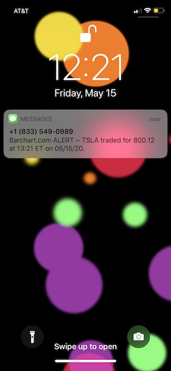
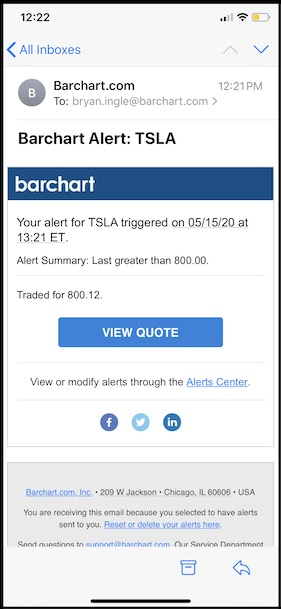

## Purpose

**This SDK allows you to connect and interact with the _Barchart Alert Service_. You can define alert conditions, ask our remote service to track those conditions on your behalf, and receive immediate notifications when those conditions are met.**

Here's how it works:

* You _choose_ notification mechanism(s):
	* Receive notifications to your web service, via HTTP POST (you handle last mile)
	* Receive notifications via email
	* Receive notifications via SMS messages
	* Receive push notifications to your mobile applications (coming soon)
* You _define_ an alert. Each alert has one or more conditions, for example:
	* Apple common stock trades over $500.00 per share
	* Apple common stock achieves a new 30 high
	* A news article, mentioning Apple common stock, was just published
* You _start_ the alert:
	* Barchart's Alert Service will continuously monitor your conditions
	* Once your conditions are met, notifications are dispatched

## Sample Notifications

| SMS  | Email |
| -------- | --------|
|  |   |

## Streaming Data Catalog

Any data streams within the Barchart ecosystem can be used to build alert conditions.

Barchart offers an exhaustive array of market data for multiple asset classes which trade on exchanges around the world. Consult our [website](https://www.barchart.com/solutions/data/market) for more information.

Here are some examples:

* Price Data (real-time or delayed)
	* Trades and Quotes
	* New Highs and Lows
	* Prior Day Prices and Gaps
	* More...
* Technical Analysis Data
	* Support and Resistance
	* Moving averages
	* Stochastic indicators
	* More...
* News Feeds
	* Associated Press
	* Comtex News Network
	* PR Newwire
	* More...
* Commodity Cash Bid Data
	* Grain Basis Prices
	* Grain Cash Prices
	* More...

## Supported Environments

This SDK provides a convenient way to interact with the Barchart Alert Service. We recommend using it in JavaScript environments.

#### Web Browsers

This SDK can be distributed as part of your browser-based applications. The source code is written in [ES2017](https://en.wikipedia.org/wiki/ECMAScript). Consequently, transpilation (with appropriate polyfills) is recommended before distribution.

#### Node.js

This SDK is compatible with Node.js.

#### Direct Access

The Barchart Alert Service implements a REST interface via HTTP. You may choose to interact with the service directly, bypassing this SDK entirely. An [OpenAPI](https://www.openapis.org/) specification of the interface can be found in the [API Reference](/content/api_reference) section.

#### Other

If JavaScript isn't suitable for your environment and you're not interested in direct access, please contact us at solutions@barchart.com or (866) 333-7587.

## User Privacy

#### User Privacy (General)

Privacy is important to Barchart. You can read our privacy policy here:

[https://www.barchart.com/solutions/company/terms-and-privacy](https://www.barchart.com/solutions/company/terms-and-privacy)

#### User Privacy (Alert Service)

**You can avoid sharing identifying information regarding your users.**

Here's how:

* Each alert is owned by a user. You must provide unique user identifiers for those users. However, the identifiers can be meaningless — other to differentiate one user from another. A common technique is to use [Universally Unique Identifiers](https://en.wikipedia.org/wiki/Universally_unique_identifier).
* Each notification delivered to a user. Barchart can deliver notifications on your behalf. Alternately, we can deliver notifications to your web service. In this manner, you handle the "last mile" of delivery for notifications and forgo the need to provide us with contact information for your users..
