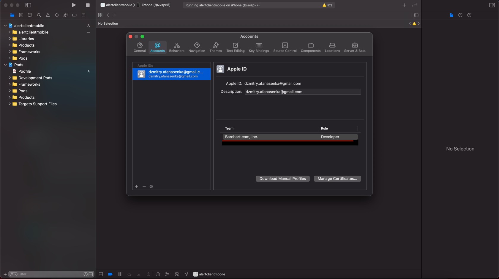
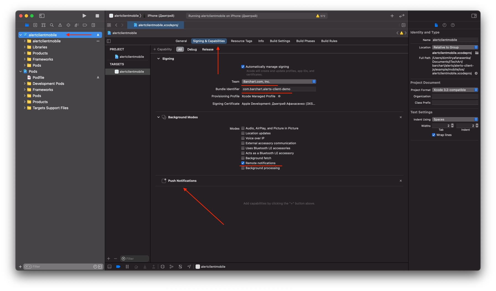
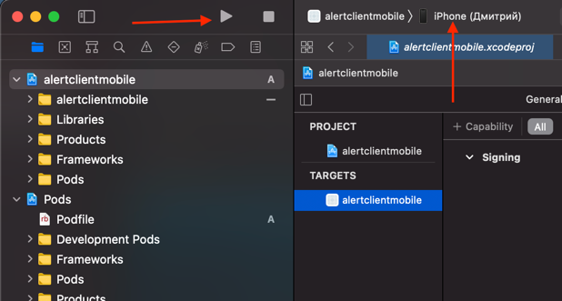

# @barchart/alerts-mobile-demo

### Overview

This is an example application that connects to the **[Barchart](https://www.barchart.com) Alerting Service**.

This app is written using [React Native](https://reactnative.dev/).

### How to run

> You must be added to the Barchart Apple Development Team.

> You must run the application on a real device. Push Notifications will not work on the simulator.

Here is a step-by-step guide how to run and test the application:

1. Run `npm install` command in the root folder of the repository.
2. Run `yarn install` command in the `example/mobile` folder.
3. Run `npx pod-install` command in the `example/mobile/ios` folder.
   3.1 If you have got an error `SDK "iphoneos" cannot be located`, read this [article](https://www.ryadel.com/en/xcode-sdk-iphoneos-cannot-be-located-mac-osx-error-fix/).
4. Run `brew install watchman` command.
5. Open `example/mobile/ios/alertclientmobile.xcworkspace` file with XCode.
6. Go to `XCode -> Preferences` and make sure that you are in the Barchart Development Team.

7. Click on the `alertclientmobile` on the left sidebar and go to the `Signing & Capabilities` section. Make sure that this section looks like on this picture.

   7.1. Team must be `Barchart.com, Inc.`.

   7.2. Bundle Identifier must be `com.barchart.alerts-client-demo`.

   7.3. `Remote notifications` and `Push Notifications` must be enabled.

8. Connect your iPhone to your macOS device, select your iPhone as a target to run the application, and click the run button (It may ask for a password for a Key Chain).

9. The Application will ask for notification permissions. Allow it.

10. Use app.