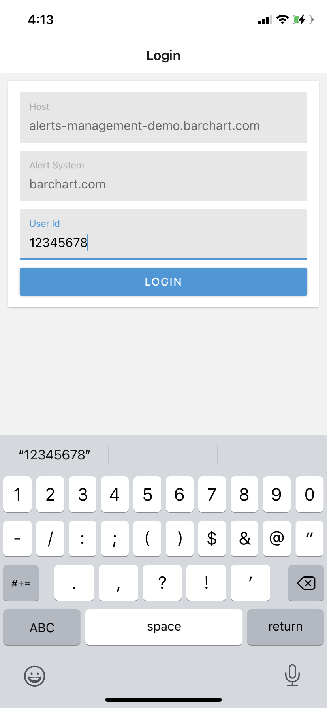
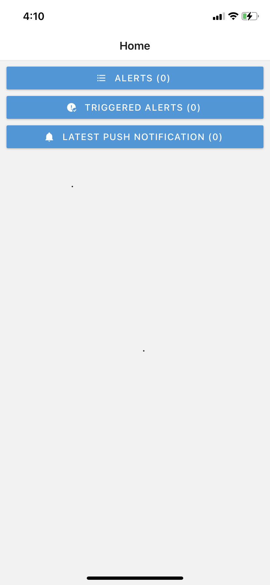
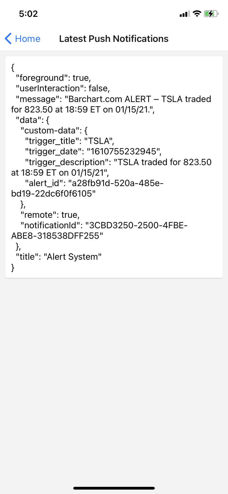
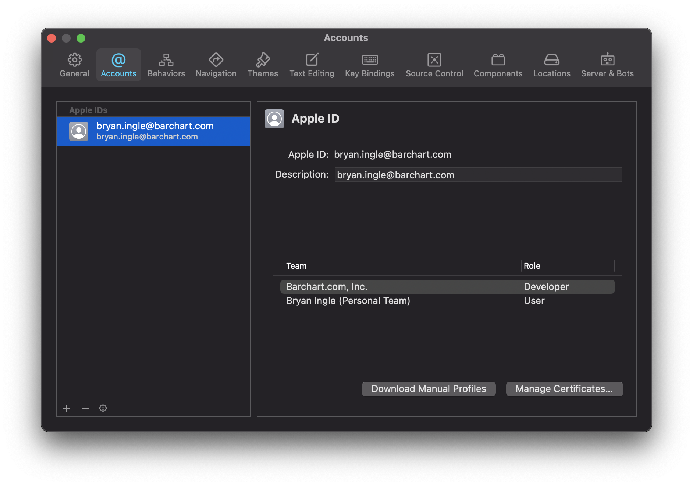
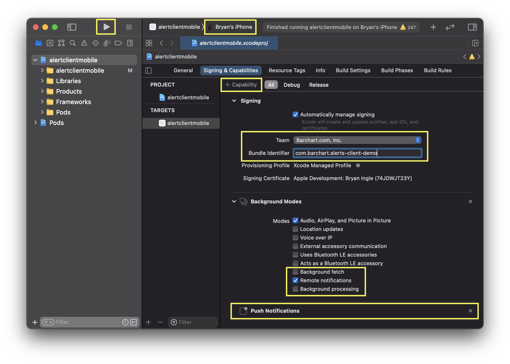
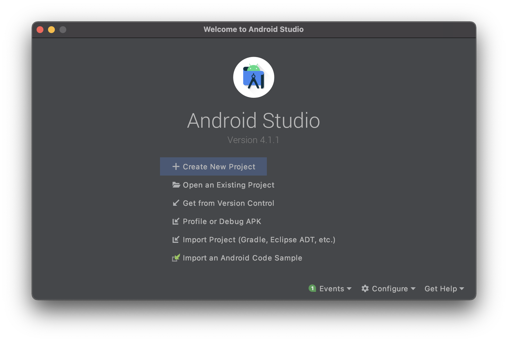
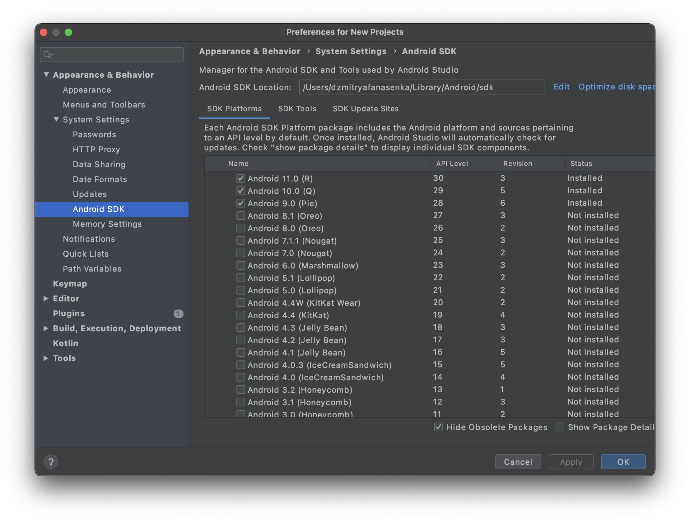
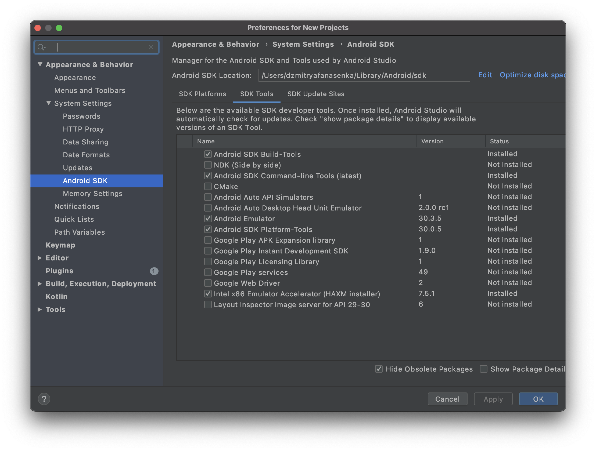
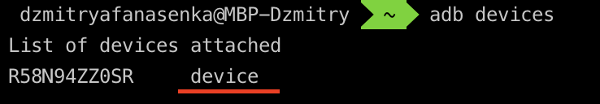

# @barchart/alerts-mobile-demo

### Overview

A simple mobile app, written using [React Native](https://reactnative.dev/) and the [JavaScript SDK for the Barchart Alerting Service](https://github.com/barchart/alerts-client-js).

### Screen Captures

| Login  | Home | Triggers |
| -------- | -------- | -------- |
|  |  |  |

Also, here is a [video clip](.images/examples/04_app_push_notification.mov), showing receipt of a push notification.

### Requirements

The push notification feature of this app require you to:

* Authorize Barchart to send push notifications on your behalf (see [below](#authorizing-push-notifications)).
* Run the app on an actual device — not a simulator.

### Build and Execution Instructions

#### Apple iOS

First, install [Apple Xcode](https://developer.apple.com/xcode/). Open Xcode and use the `Xcode > Preferences` menu to sign in. Your Apple ID should be a member of a valid team (more on that [below](#apple-developer-teams)).


   
Next, configure the project:

1. Run `brew install watchman`.
2. Run `npm install` from the root folder of the repository.
3. Run `yarn install` from the `example/mobile` folder.
4. Run `npx pod-install` command from the `example/mobile/ios` folder.
   * If the command fails, consult this [article](https://stackoverflow.com/questions/51768515/cocoa-pods-install-on-ios-project-not-working).
5. Open `example/mobile/ios/alertclientmobile.xcworkspace` file with Xcode.
6. Click on `alertclientmobile` and go to the `Signing & Capabilities` section, then:
   * Set your Team (e.g. `Barchart.com, Inc.`).
   * Set the Bundle Identifier (e.g. `com.barchart.alertsclientdemo`).
   * Ensure the `Remote Notifications` option is checked.
   * Ensure the `Push Notifications` capability has been enabled.
7. Connect your iOS device to your computer.
8. Select your iOS device in Xcode.
9. Build and run the app using the play button. This may take several minutes.
10. Once the app loads, grant it permissions to receive push notifications.



#### Android

1. Run `brew install watchman`.
2. Run `npm install` from the root folder of the repository.
3. Run `yarn install` from the `example/mobile` folder.
4. Install `Java Development Kit`. Run the following command: `brew install --cask adoptopenjdk/openjdk/adoptopenjdk8`.
5. Download and install [Android Studio](https://developer.android.com/studio/index.html). 

While on Android Studio installation wizard, make sure the boxes next to all of the following items are checked:

- Android SDK
- Android SDK Platform
- Android Virtual Device
- If you are not already using Hyper-V: Performance (Intel ® HAXM) (See here for AMD or Hyper-V)

Then, click "Next" to install all of these components.

> If the checkboxes are grayed out, you will have a chance to install these components later on.

Once setup has finalized and you're presented with the Welcome screen, proceed to the next step.

6. Install the Android SDK.

Android Studio installs the latest Android SDK by default. Building a React Native app with native code, however, requires the `Android 10 (Q)` SDK in particular. Additional Android SDKs can be installed through the SDK Manager in Android Studio.

To do that, open Android Studio, click on `Configure` button and select `SDK Manager`. Select the "SDK Platforms" tab from within the SDK Manager, then make sure the following items are checked:







7. Configure the ANDROID_HOME environment variable.

The React Native tools require some environment variables to be set up in order to build apps with native code.

Add the following lines to your `$HOME/.bash_profile` or `$HOME/.bashrc` (if you are using zsh then `~/.zprofile` or `~/.zshrc`) config file:

```
export ANDROID_HOME=$HOME/Library/Android/sdk
export PATH=$PATH:$ANDROID_HOME/emulator
export PATH=$PATH:$ANDROID_HOME/tools
export PATH=$PATH:$ANDROID_HOME/tools/bin
export PATH=$PATH:$ANDROID_HOME/platform-tools
export JAVA_HOME=/Library/Java/JavaVirtualMachines/adoptopenjdk-8.jdk/Contents/Home
export ANDROID_SDK_ROOT=$ANDROID_HOME
```

Type `source $HOME/.bash_profile` for bash or `source $HOME/.zprofile` to load the config into your current shell. Verify that ANDROID_HOME has been set by running `echo $ANDROID_HOME` and the appropriate directories have been added to your path by running `echo $PATH`.

8. Install Android Platform Tools by following command: `brew install android-platform-tools`.

9. Connect your Android phone to your machine and run following command: `adb devices`.



If you see `unregister` on you device, run following commands:

```shell
adb kill-server
adb start-server
```

10. Run `react-native run-android --deviceId=R58N94ZZ0SR` command where `deviceId` is ID of your device from the `adb devices` command. This may take several minutes.

### Authorizing Push Notifications

#### Apple Developer Teams

You must be a member of an Apple Developer Team. Furthermore, you must grant Barchart permission to send push notifications on your behalf of your organization.

Contact Barchart and provide the following information:

* Your APNs token signing key — in the form of a ```.p8``` file.
* Your ten character identifier for the aforementioned the signing key.
* Your ten character identifier for your Apple Developer Team.

Instructions for collecting this information can be found here:

* [Establishing a Token-Based Connection to APNs](https://developer.apple.com/documentation/usernotifications/setting_up_a_remote_notification_server/establishing_a_token-based_connection_to_apns)

#### Google Firebase Cloud Messaging

Coming soon.
