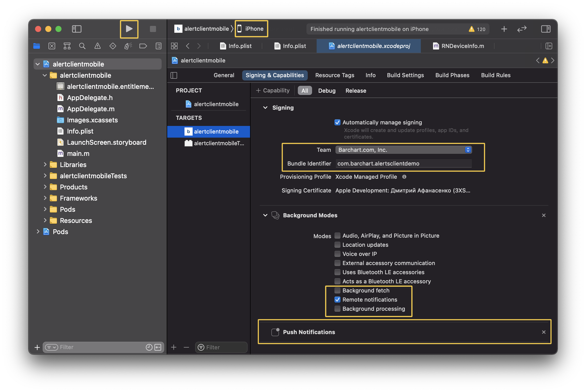

# @barchart/alerts-mobile-demo

### Overview

A simple mobile app, written using [React Native](https://reactnative.dev/) and the [JavaScript SDK for the Barchart Alerting Service](https://github.com/barchart/alerts-client-js).

### Screen Captures

| Login  | Home | Triggers |
| -------- | -------- | -------- |
|  |  |  |

Also, here is a [video clip](.images/examples/04_app_push_notification.mov), showing receipt of a push notification.

### Requirements

The push notification feature of this app require you to:

* Authorize Barchart to send push notifications on your behalf (see [below](#authorizing-push-notifications)).
* Run the app on an actual device — not a simulator.

### Build and Execution Instructions

#### Apple iOS

First, install [Apple Xcode](https://developer.apple.com/xcode/). Open Xcode and use the `Xcode > Preferences` menu to sign in. Your Apple ID should be a member of a valid team (more on that [below](#apple-developer-teams)).


   
Next, configure the project:

1. Run `brew install watchman`.
2. Run `npm install` from the root folder of the repository.
3. Run `yarn install` from the `example/mobile` folder.
4. Run `npx pod-install` command from the `example/mobile/ios` folder.
   * If the command fails, consult this [article](https://stackoverflow.com/questions/51768515/cocoa-pods-install-on-ios-project-not-working).
5. Open `example/mobile/ios/alertclientmobile.xcworkspace` file with Xcode.
6. Click on `alertclientmobile` and go to the `Signing & Capabilities` section, then:
   * Set your Team (e.g. `Barchart.com, Inc.`).
   * Set the Bundle Identifier (e.g. `com.barchart.alerts-client-demo`).
   * Ensure the `Remote Notifications` option is checked.
   * Ensure the `Push Notifications` capability has been enabled.
7. Connect your iOS device to your computer.
8. Select your iOS device in Xcode.
9. Build and run the app using the play button. This may take several minutes.
10. Once the app loads, grant it permissions to receive push notifications.



#### Android

Coming soon.

### Authorizing Push Notifications

#### Apple Developer Teams

You must be a member of an Apple Developer Team. Furthermore, you must grant Barchart permission to send push notifications on your behalf of your organization.

Contact Barchart and provide the following information:

* Your APNs token signing key — in the form of a ```.p8``` file.
* Your ten character identifier for the aforementioned the signing key.
* Your ten character identifier for your Apple Developer Team.

Instructions for collecting this information can be found here:

* [Establishing a Token-Based Connection to APNs](https://developer.apple.com/documentation/usernotifications/setting_up_a_remote_notification_server/establishing_a_token-based_connection_to_apns)

#### Google Firebase Cloud Messaging

Coming soon.
